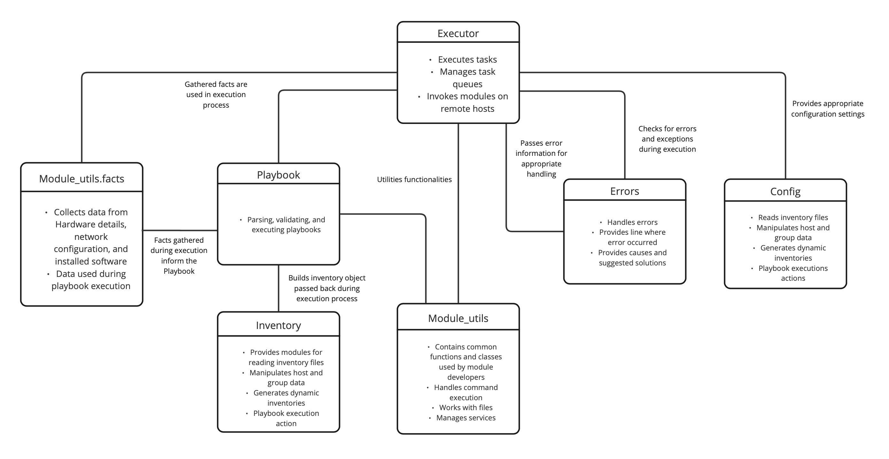

# Context & Background  

## Software Description:
Ansible is a cross-platform tool for resource provisioning automation that can be used in combination with DevOps to make complex tasks easier to manage. A few of the tasks it can automate includes installing software, provisioning infrastructure, improving security and compliance and sharing automation.

## Software Creators:
Created by Michael Dehann and it was later acquired by Red Hat in 2015. Red Hat continues to maintain Ansible and is a fairly mid sized company with approximately 19,000 employees. There are currently contributions from 5,000 users and there ongoing commits being made to the repository.

## More information 
[Official Github](https://github.com/ansible/ansible/tree/devel) |
[Developer Guide](https://docs.ansible.com/ansible/devel/dev_guide/) |
[How Ansible Works](https://www.ansible.com/overview/how-ansible-works) |

# Development View
Ansible playbook execution overview:

The explanation below is an example of Ansible's functions and illustrates how the components we've chosen to analyze work together. Note that these are not the only modules and packages involved in the process, rather a high-level of abstraction view.

Prior to playbook execution occurring, Ansible executes the `setup` module from `ansible.module_utils.facts` on each target host. This provides data about the hosts including operating system details, network interfaces, disk information, and installed packages. During playbook execution, gathered facts are accessed from stored memory.

To begin the execution, `ansible.playbook` reads and parse the playbook file interpreting the tasks, plays, and defined configurations. It identifies  the hosts and groups given in the playbook which are managed by `ansible.inventory`.

The `ansible.inventory` component deals with inventory management, containing information about target hosts and their grouping. It reads the inventory files and dynamic inventory sources and builds an inventory object. This object is passed back to the playbook execution process.

Task execution begins with the `ansible.executor` component which retrieves the list of tasks defined in the playbook and goes through them sequentially. The executor determines the target hosts and executes the associated modules. The proper modules are drawn from the `ansible.module_utils` package. 

While the execution is occurring, `ansible.config` component ensures that the desired configuration settings are applied. Configuration options can include connectivity, variable handling, file parsing, or playbook specific entities. 

All the while, `ansible.errors` is checking for errors and exceptions that may occur during playbook execution. This component provides error reporting, logging, and ways to address errors. If an error occurs, `ansible.executor` captures the error information and passes it to the `ansible.errors` component for appropriate handling.

### Table of High Level Components
| Component | Role & Relationship | Description |
| --------------------- | ------- | -------------------------- |
| Module_utils | Module Development. Used by the ansible playbook. | Provides utility modules which contain common functions and classes that can be used by module developers. Includes modules for handling command execution, working with files, and managing services. |
| Executor | Task execution. Depends on Module_utils.common. Uses playbook, module_utils.facts, errors, and config. | Enables task execution and module invocation. Involves modules for task execution and management. |
| Module_utils.facts | Module discovery. Used by ansible.playbook | Involves gathering facts and system information from remote hosts. |
| Playbook | Playbook development. Depends on ansible.module_utils.facts. Uses inventory and module_utils. | This package involves modules that work with Ansible playbooks. Allows for parsing, validating, and executing playbooks. |
| Config | Handles configuration settings. | Ensures the desired configuration settings. Consulted whenever needed during the execution process.  |
| Inventory | Inventory management. Used by playbook. | Provides modules for reading inventory files, manipulating host and group data, generating dynamic inventories, and playbook execution actions. |
| Errors | Error handling. Used by the Executor | Handles all errors raised by Ansible code. Returns the line in the file corresponding to the error and causes and suggested solutions for the error. |

### System Organization
<figcaption align="center"> <b>A structure diagram of Ansible in UML component diagram format</b> </figcaption>

<figcaption align="center"> <b>Figure 2: UML Component Diagram for Ansible</b> </figcaption>

# Applied Perspective
A system's resource owners can regulate who has access to which resources by using a set of procedures and tools known as security. The individuals, pieces of software, and other entities that make up the who are referred to as the group of system actors with a security identity. Resources are the delicate parts of the system, such as subsystems, data items, and activities, to which access must be controlled. Both the requirement that access be confined to principals the system is aware of and the actions that system principals will legitimately wish to do (such as reading, changing, or executing them) are referred to as "access to the resources" in this context.

The security of your systems, your data, and the data of your customers is of the utmost importance. As stated under Ansible website for their security policy, you’re able to create a secure component of your system using Ansible’s playbook syntax. That syntax can be applied to custom security policies, configuring firewall rules, and restricting specific users and groups. Security information and event management (SIEM) systems are used to collect and analyze security incidents. Ansible provides developers with programmatic access to a range of data sources, giving security analysts the most up-to-date information possible to assess scenarios.

Some of the concerns in regards to Ansible security system is that it doesn’t require a single target login name. It indicates that administrators aren’t permitted to use a personal account on each target server and have a sudo access with passwords.This is important since you can now see who performed what in the logs and you won't need a single anonymous super user. Another smart security measure that should be taken into conversation for Ansible is to steer clear of names like admin and ansible when generating admin accounts. If the username is easy to guess, an attacker is already halfway to gaining access to your automated orchestration tool. You must select identifications that can be tracked and connected to a particular individual. After that, it is the owner's obligation to keep this username secure. As a result, your audit logs will expand, making it easier to locate and pinpoint the source of any issues down the roads.

In conclusion, the security of your Ansible automation can be readily increased by utilizing Ansible to vary your accessibility using targeted and traceable usernames. Even though Ansible uses SSH, it is largely hands-off once automation is up and going. In other words, if your sensitive data is not protected at the source, malicious hijacking may take place without your knowledge.

# Identify Style & Patterns Used

## Design Patterns:

Found in multiple components, but started in ansible/lib/ansible/module/blockinfile.py

**Module pattern**: The entire code is encapsulated within a Python module. The purpose of a module is to organize code in a logical way, which makes the code easier to understand and use. In the code, all functions and the main execution are encapsulated within a single script.

**Strategy pattern**: The use of this pattern is visible in the handling of different strategies for inserting blocks of text. Depending on whether the "insertbefore" or "insertafter" parameter is used, the script employs a different strategy for determining the position of the block.

**Template Method pattern**: The main() function acts as a template method. This design pattern defines the program skeleton of an algorithm in an operation, deferring some steps to subclasses. In the Ansible code, the main function sets up some parameters and the flow of execution, but the specific behavior is implemented in helper functions like write_changes and check_file_attrs. This is true in majority components in modules. 

**Singleton pattern**: This pattern restricts instantiation of a class to a single instance, and provides a global point of access to it. In the script, the AnsibleModule instance could be considered a kind of singleton since only one is created per execution of the script

# Architectural Assessment 
## 1. Separation of Concerns
Ansible’s architecture adheres to this principle at a high level of abstraction through layer cohesion, as each of the modules are grouped together by their responsibility. This is exemplified under the `module_utils / facts ` package where data is collected to then be used in playbook execution. Under this are the following packages:

* `hardware`
* `network`
* `other`
* `system`
* `virtual`

Each package is then further broken up into modules based on different concerns such as the hardware package that deals with data related to hardware systems. The hardware system contains the following modules:

* `aix.py`
* `base.py`
* `darwin.py`
* `dragonfly.py`
* …

Ansible is broken up into distinct categories and maintains high cohesion so the the system is easier to maintain and improve. At a higher level Ansible is able to follow this principle but when analyzing at a code-level of abstraction it fails to adhere to this principle. In the AIXHardware class, it does have different methods for retrieving facts such as `get_cpu_facts`, `get_memory_facts`, and `get_dmi_facts`. But in the `populate` method it then combines the results from these methods into `hardware_facts.` To achieve separation of concerns would be better to further break up the code so that each is retrieving a specific type of hardware information. 

## 2. Principle of Least Knowledge (Law of Demeter):

The Principle of Least Knowledge, or the Law of Demeter, is a principle that promotes loose coupling in various software applications and architectures. According to this principle, an object should only communicate with its immediate neighbors and should not have knowledge about the inner workings of the encapsulated objects. We can see Ansible complies with this principle, because Ansible’s architecture largely abides through thee use of modules and its agentless nature. Ansible sends modules to the node machines but does not need to know the specific implementation details of these modules. All it needs to know is the overall interface, which is how to send them information and what output to expect. This means the internals of the modules and components remain encapsulated and the changes within them do not directly affect each other, and the control machine. Overall, this program largely adheres to the Principle of Least Knowledge, helping maintain low coupling and increasing maintainability. 

